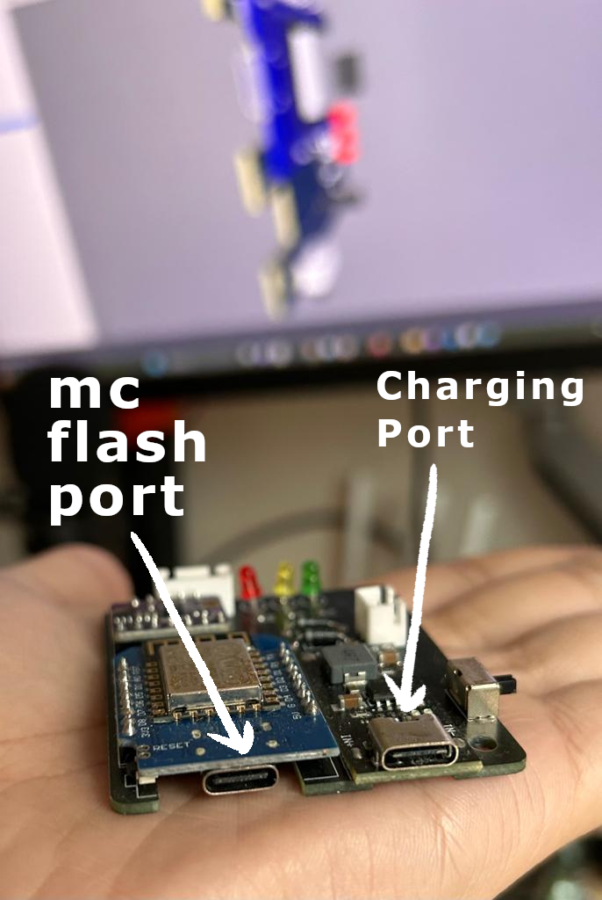
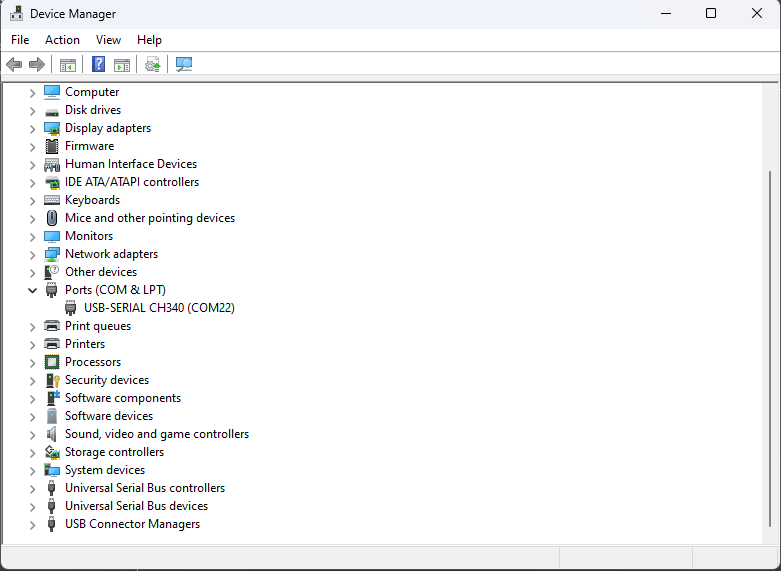
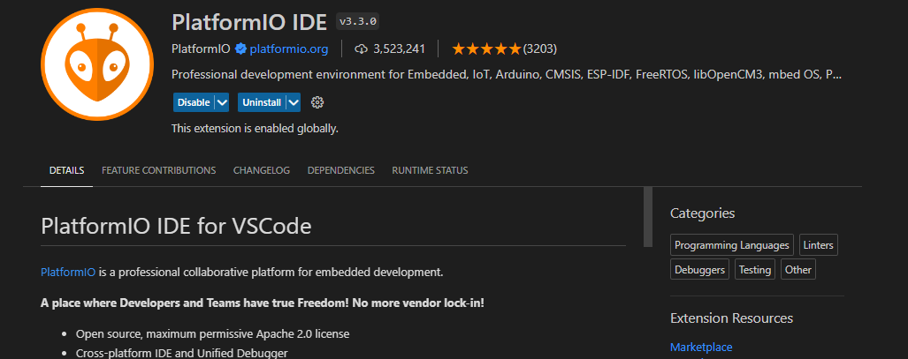
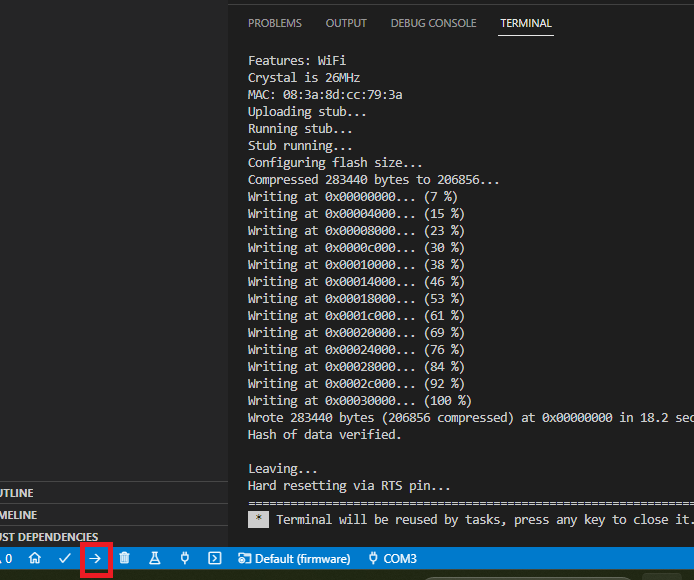
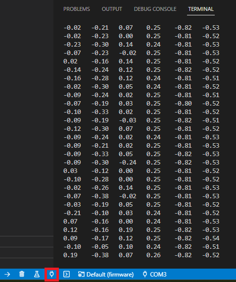
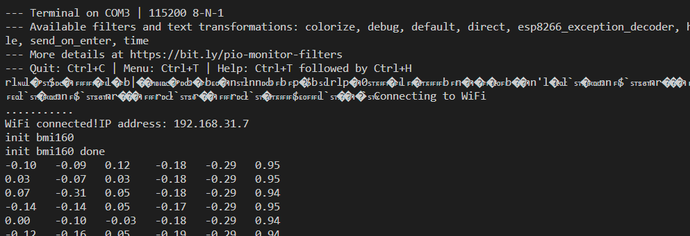
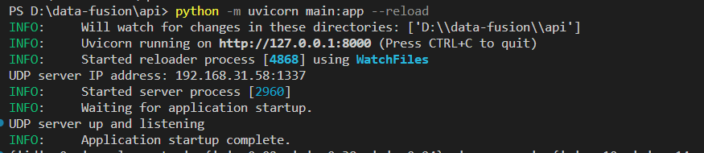
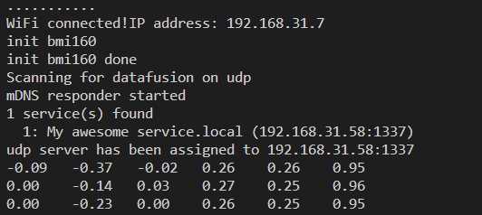
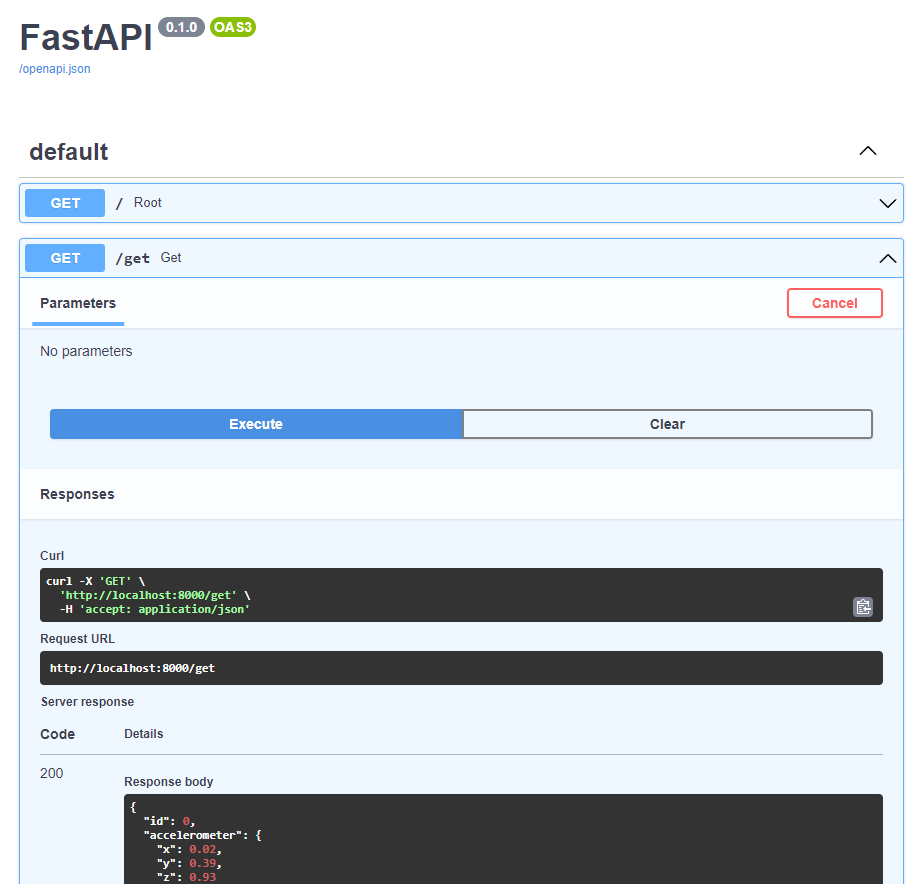

# data-fusion
 apriltags + imus ❤️

## Setup

for this project for the microcontroller flashing and we will be using:

- [vscode](https://code.visualstudio.com/)
- [platformio](https://marketplace.visualstudio.com/items?itemName=platformio.platformio-ide)

additionally, for the python scripts we will be using:

- [python3](https://www.python.org/downloads/)

for jupyter notebooks you can either view them on vscode (recommended) or use:

- [jupyter](https://jupyter.org/install)


## Project structure:

- `firmware/` contains the microcontroller code
- `api/` - contains the python api for exposing the microcontroller data.
- `viewer/` - contains the sveltekit visualization code.


## Firmware Setup

As for the physical setup, you will need:

- ESP8266 microcontroller board provided to you.
- USB C cable to connect the microcontroller to your computer.

There are two connectors on the microcontroller board, one for the serial communication with the computer and the other for usb charging of a lipo battery. Use the flash connector to connect the microcontroller to your computer.

 

Once the usb has been connected to your computer it should show up as a serial device, you can check on your device if it has been connected with the device manager:



If it were not showing up most likely you will need to install the drivers for the CH340 serial chip on the microcontroller board, you can find the drivers for your operating system here, [drivers](https://cdn.sparkfun.com/assets/learn_tutorials/8/4/4/CH341SER.EXE).

For the microcontroller code, you will need to install the platformio extension for vscode:


[platformio](https://marketplace.visualstudio.com/items?itemName=platformio.platformio-ide)

Once installed, you can open the folder `firmware/` in vscode.

The firmware project is structured as follows:

- include
	- README
- lib
	- bmi160
		- bmiutils.h
	- leds
		- leds.c
		- leds.h
	- networking
		- network.h
	- README
- src
	- main.cpp
- test
	- README
- .gitignore
- platformio.ini

In the `src` folder you will find the main.cpp file, this is the main file that contains the enabled features of the microcontroller.

For a start a simple serial readout of the IMU data can be enable as follows:

```cpp
#include <Arduino.h>
#include "aheader.h"
#include "network.h"
#include "leds.h"
#include "bmiutils.h"
void setup()
{
  Serial.begin(115200);
  init_bmi160();
}

void loop()
{
  print_bmi160();
}
```

All the logic regarding the IMU is in the `bmiutils.h` file, and the `print_bmi160()` function prints the IMU data to the serial port.

To flash the code to the microcontroller, you can use the platformio extension in vscode, and click on the upload button:



Once the code has been flashed, you can open the serial monitor to see the output of the microcontroller:



The output should be similar to this:

```bash
-0.05   -0.23   0.02    0.25    -0.81   -0.53
-0.14   -0.26   0.05    0.25    -0.81   -0.52
-0.02   -0.14   0.14    0.24    -0.81   -0.53
```

The first the columns are the gyroscope data and the last three columns are the accelerometer data. So as a table it would look like this:

| gx    | gy    | gz    | ax    | ay    | az    |
| ----- | ----- | ----- | ----- | ----- | ----- |
| -0.05 | -0.23 | 0.02  | 0.25  | -0.81 | -0.53 |
| -0.14 | -0.26 | 0.05  | 0.25  | -0.81 | -0.52 |
| -0.02 | -0.14 | 0.14  | 0.24  | -0.81 | -0.53 |

The IMU data for each of the gyroscopes is in degrees per second and the accelerometer data is in g's. 

### Wifi Setup

To enable the wifi on the microcontroller, you will need to uncomment the following lines in the `main.cpp` file:

```cpp
#include <Arduino.h>
#include "network.h"
#include "leds.h"
#include "bmiutils.h"
void setup()
{
  Serial.begin(115200);
  init_wifi();
  init_bmi160();
}

void loop()
{
  print_bmi160();
}
```

you can hardcode the wifi credentials in the `network.h` file:

```cpp
static String ssid = "yourssid";
static String password = "yourpassword"
```

		TODO: add password set up dinamically through serial.



### Activate API server

To comunicate freely with any application within the local network a udp server api handles the data exchange within the microcontroller and whichever application you want to use, in the future the data fusion between the microcontroller and the apriltags will be done in this api, for the api we are using FastAPI, a python framework for building apis.

To install the dependencies for the api, you will need to install the requirements.txt file:

```bash	
cd api
pip install -r requirements.txt
```

To install the dependancies for fast api make use of the following command:

```bash
pip install "fastapi[all]"
```

Once the dependencies have been installed, you can run the api server with the following command:

```bash
uvicorn main:app --reload
```

or 

```bash
python -m uvicorn main:app --reload
```

After running the command, you should see the following output:



To connect your microcontroller the API server, you will need to uncomment the following lines in the `main.cpp` file:

```cpp
#include <Arduino.h>
#include "network.h"
#include "leds.h"
#include "bmiutils.h"
void setup()
{
  Serial.begin(115200);
  init_wifi();
  init_bmi160();
  find_udp_server();
}

void loop()
{
  print_bmi160();
  send_bmi_data(send_data);
}
```
If the mDNS server is running, the microcontroller will find the API server and connect to it thru UDP, you should see the following output in the serial monitor:



To check the data you can go to the following url:

[http://localhost:8000/docs](http://localhost:8000/docs)



You can test methods declared declared on the `main.py`.
<!-- ## Sveltekit Setup

for visualization we will be using sveltekit, you will need nodejs to run it:

- [nodejs](https://nodejs.org/en/download/)

to run the visualization, you will need to install the dependencies and run the dev server:

```bash
cd viewer
npm install
npm run dev
```

## Installing three.js for sveltekit
```bash
npm install --save three 
npm i --save-dev @types/three
``` -->

# PCB Layout

[https://oshwlab.com/celestine.s.machuca/motion-fusion](https://oshwlab.com/celestine.s.machuca/motion-fusion)